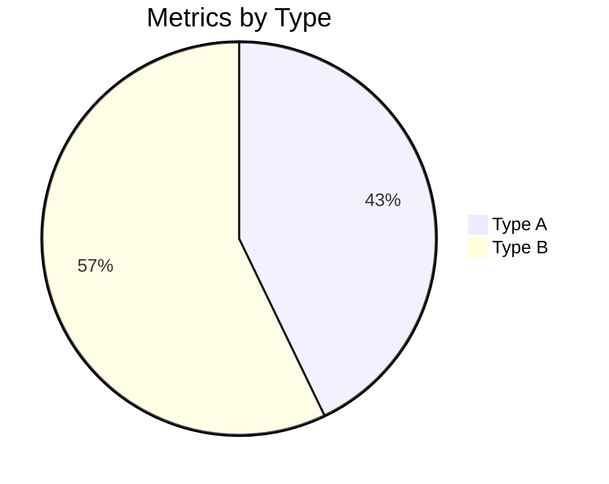

# Next Session Prompt: Go Live with Chart Streaming

## Context

**Previous Session Accomplishments:**
- ✅ Implemented full chart streaming infrastructure (Mermaid + Vega-Lite)
- ✅ Created `chartGenerationTool` for AI agents
- ✅ Built OKR metrics visualization integration
- ✅ Tested with real data from okr_metrics.db (47 companies)
- ✅ All code committed and in main branch

**What's Left:** Wire up the OKR agent to use charts in production

## Work to Do (Today's Session)

### Issue: `feishu_assistant-l39`
**Title:** Integrate chart streaming into OKR reviewer agent

### Quick Implementation (30-45 min)

**Step 1: Add tool to OKR agent** (5 min)

File: `lib/agents/okr-reviewer-agent.ts`

```typescript
// Add import near top
import { chartGenerationTool } from '../tools/chart-generation-tool';

// In getOkrReviewerAgent() function, add to tools array:
tools: [
  createOkrReviewTool(...),  // existing
  chartGenerationTool         // ADD THIS
]
```

**Step 2: Update agent system prompt** (5 min)

In same file, update instructions to mention chart capability:

```
"When users ask for OKR analysis WITH charts, visualizations, 
or comprehensive reports, you can generate streaming visualizations 
using the chart tool. This includes:
- Bar charts: has_metric % by company
- Pie charts: metric type distribution  
- Comprehensive reports: multi-chart analysis with insights

Example queries users might ask:
- '给我OKR分析和图表' (Give me OKR analysis with charts)
- 'OKR可视化分析' (OKR visualization analysis)
- 'Show me OKR performance charts'
"
```

**Step 3: Test with Feishu** (20-30 min)

1. Start dev server: `bun run dev`
2. Send message to bot in Feishu: `"OKR分析和图表 10月"`
3. Verify:
   - ✅ Agent recognizes request
   - ✅ Calls streamComprehensiveOKRAnalysis('10 月')
   - ✅ Charts stream progressively
   - ✅ Bar chart renders (company performance)
   - ✅ Pie chart renders (metric types)
   - ✅ Insights text appears

### Success Criteria

- [ ] Code compiles: `bun run build` succeeds
- [ ] Feishu message triggers OKR response with charts
- [ ] At least one chart appears in card
- [ ] Streaming works (typewriter effect with chart definition)
- [ ] No errors in logs

### Testing Data

Use these queries in Feishu to test:
```
OKR分析和图表
给我看10月的OKR分析
Show me comprehensive OKR report
可视化我们的OKR指标
```

Real data will be queried from okr_metrics.db automatically.

## Key Files to Know

**Implementation:**
- `lib/agents/okr-reviewer-agent.ts` - Where to add tool (main change)
- `lib/tools/chart-generation-tool.ts` - The tool (already complete)
- `lib/okr-chart-streaming.ts` - OKR data transform functions
- `lib/visualization/mermaid-charts.ts` - Mermaid builders
- `lib/visualization/vega-lite-charts.ts` - Vega-Lite builders

**Documentation:**
- `history/CHART_FOR_MARKDOWN_INTEGRATION.md` - Architecture
- `history/CHART_USAGE_GUIDE.md` - Complete reference
- `NEXT_SESSION_CHARTS.md` - Integration guide
- `history/WHY_CHARTS_IN_MARKDOWN_WORK.md` - How it works

## What to Expect

When user says "OKR分析和图表":

1. Agent receives message
2. Recognizes OKR + chart request
3. Calls `streamComprehensiveOKRAnalysis('10 月')`
4. Returns markdown with embedded charts:
   - Vega-Lite JSON spec for bar chart (has_metric by company)
   - Mermaid pie chart (metric types)
   - Text insights (top/bottom performers)
5. Markdown streams to Feishu card
6. Charts render progressively

Example output structure:
```
# OKR Metrics Analysis Report
**Period**: 10 月
**Overall Average Has Metric**: 43.5%

## 1. Company Performance
```json
[vega-lite bar chart spec - 47 companies]
```

## 2. Metric Type Distribution


## 3. Summary Insights
- **Top performer**: 长春区域公司 (76%)
- **Lowest performer**: ... (%)
- **Performance spread**: ... percentage points
```

## Troubleshooting

**Agent doesn't call chart tool:**
- Verify tool is in tools array
- Check agent prompt mentions charts
- Restart dev server

**Charts not rendering:**
- Check Feishu supports Mermaid/Vega-Lite
- May need image fallback (Kroki.io) - future enhancement
- Check markdown is valid in card

**Data issues:**
- Ensure okr_metrics.db exists and has data
- Check period parameter is correct format ('10 月', '11 月', etc.)
- Verify RLS permissions (should work without special config)

## Nice to Have (Future)

- [ ] Add Kroki.io image rendering for fallback
- [ ] Support filtering by company or metric type
- [ ] Add time-series chart (period trends)
- [ ] Cache chart results for performance
- [ ] Add drill-down from chart (click to see details)

## Commands to Have Ready

```bash
# Build & test
bun run build
bun run dev
bun test

# Check db
ls -la okr_metrics.db
```

## When Done

1. Verify end-to-end flow works
2. Test with multiple queries
3. Commit any changes
4. Create next issue if needed (e.g., image fallback)

---

**Time estimate**: 30-45 minutes total
**Difficulty**: Easy (mostly configuration, code already complete)
**Impact**: High (makes OKR data visualization live for all users)

**Good luck! You're almost done! 🚀**
