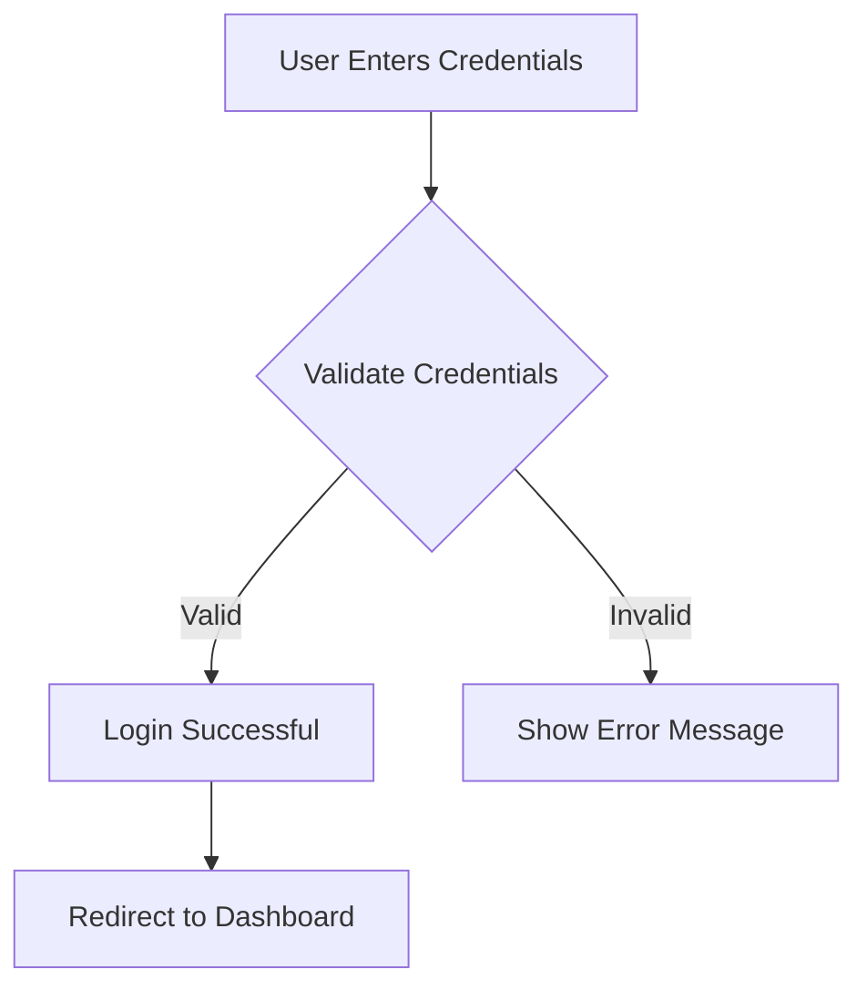

# Charts - Quick Examples for Agents

Copy-paste these examples to test the chart generation tool immediately!

---

## Example 1: User Authentication Flow (Flowchart)

```typescript
const flowchart = await chartGenerationTool({
  chartType: 'mermaid',
  subType: 'flowchart',
  title: 'User Authentication Flow',
  description: 'How users log in to the system',
  data: {
    steps: [
      { id: 'start', label: 'User Enters Credentials' },
      { id: 'validate', label: 'Validate Credentials', shape: 'diamond' },
      { id: 'success', label: 'Login Successful' },
      { id: 'error', label: 'Show Error Message' },
      { id: 'redirect', label: 'Redirect to Dashboard' }
    ],
    connections: [
      { from: 'start', to: 'validate' },
      { from: 'validate', to: 'success', label: 'Valid' },
      { from: 'validate', to: 'error', label: 'Invalid' },
      { from: 'success', to: 'redirect' }
    ]
  }
});

// Result: markdown containing mermaid flowchart
console.log(flowchart.markdown);
```

**Output in Feishu**:
```

```

---

## Example 2: Sales Data by Region (Bar Chart)

```typescript
const salesChart = await chartGenerationTool({
  chartType: 'vega-lite',
  subType: 'bar',
  title: 'Q1 2024 Sales by Region',
  description: 'Regional sales performance comparison',
  data: [
    { category: 'North America', value: 125000 },
    { category: 'Europe', value: 98000 },
    { category: 'Asia Pacific', value: 157000 },
    { category: 'Latin America', value: 67000 }
  ],
  options: {
    width: 500,
    height: 300,
    xLabel: 'Region',
    yLabel: 'Sales ($)'
  }
});

console.log(salesChart.markdown);
```

---

## Example 3: Product Roadmap Timeline

```typescript
const timeline = await chartGenerationTool({
  chartType: 'mermaid',
  subType: 'timeline',
  title: '2024 Product Roadmap',
  description: 'Key milestones for product releases',
  data: [
    { date: '2024-Q1', event: 'Launch MVP' },
    { date: '2024-Q2', event: 'Beta User Testing' },
    { date: '2024-Q3', event: 'Public Beta Release' },
    { date: '2024-Q4', event: 'General Availability' }
  ]
});

console.log(timeline.markdown);
```

---

## Example 4: User Growth Trend (Line Chart)

```typescript
const growthChart = await chartGenerationTool({
  chartType: 'vega-lite',
  subType: 'line',
  title: 'Monthly Active Users',
  description: 'User growth trend over the past year',
  data: [
    { x: '2023-01', y: 5000 },
    { x: '2023-02', y: 5500 },
    { x: '2023-03', y: 6200 },
    { x: '2023-04', y: 7100 },
    { x: '2023-05', y: 8300 },
    { x: '2023-06', y: 9500 },
    { x: '2023-07', y: 11200 },
    { x: '2023-08', y: 13000 },
    { x: '2023-09', y: 15200 },
    { x: '2023-10', y: 17500 },
    { x: '2023-11', y: 19800 },
    { x: '2023-12', y: 22000 }
  ],
  options: {
    xType: 'temporal',
    xLabel: 'Month',
    yLabel: 'Active Users',
    width: 500,
    height: 300
  }
});

console.log(growthChart.markdown);
```

---

## Example 5: Market Share Distribution (Pie Chart)

```typescript
const marketShare = await chartGenerationTool({
  chartType: 'mermaid',
  subType: 'pie',
  title: 'Market Share by Competitor',
  description: 'Current market distribution',
  data: {
    'Company A (Leader)': 35,
    'Company B': 28,
    'Company C': 18,
    'Company D': 12,
    'Others': 7
  }
});

console.log(marketShare.markdown);
```

---

## Example 6: Organizational Hierarchy

```typescript
const orgChart = await chartGenerationTool({
  chartType: 'mermaid',
  subType: 'hierarchy',
  title: 'Engineering Organization',
  description: 'Team structure and reporting lines',
  data: {
    root: 'VP Engineering',
    nodes: [
      { id: 'backend', label: 'Backend Team', parent: 'VP Engineering' },
      { id: 'frontend', label: 'Frontend Team', parent: 'VP Engineering' },
      { id: 'devops', label: 'DevOps & Infrastructure', parent: 'VP Engineering' },
      { id: 'qa', label: 'QA Team', parent: 'VP Engineering' },
      { id: 'arch', label: 'Architecture', parent: 'Backend Team' },
      { id: 'api', label: 'API Services', parent: 'Backend Team' }
    ]
  }
});

console.log(orgChart.markdown);
```

---

## Example 7: API Request Sequence

```typescript
const apiSequence = await chartGenerationTool({
  chartType: 'mermaid',
  subType: 'sequence',
  title: 'API Request Handling Sequence',
  description: 'How the system handles a typical API request',
  data: {
    actors: ['Client', 'API Gateway', 'Auth Service', 'Database'],
    interactions: [
      { from: 'Client', to: 'API Gateway', message: 'POST /api/users' },
      { from: 'API Gateway', to: 'Auth Service', message: 'Verify Token' },
      { from: 'Auth Service', to: 'Auth Service', message: 'Validate JWT' },
      { from: 'Auth Service', to: 'API Gateway', message: 'Token Valid', type: 'response' },
      { from: 'API Gateway', to: 'Database', message: 'Create User Record' },
      { from: 'Database', to: 'API Gateway', message: 'User Created', type: 'response' },
      { from: 'API Gateway', to: 'Client', message: 'User Data', type: 'response' }
    ]
  }
});

console.log(apiSequence.markdown);
```

---

## Example 8: Sprint Planning (Gantt Chart)

```typescript
const ganttChart = await chartGenerationTool({
  chartType: 'mermaid',
  subType: 'gantt',
  title: 'Sprint 42 Timeline',
  description: 'Two-week sprint schedule',
  data: [
    { id: 'design', title: 'Design Sprint', start: '2024-02-19', duration: 3, status: 'done' },
    { id: 'dev', title: 'Feature Development', start: '2024-02-22', duration: 7, status: 'active' },
    { id: 'testing', title: 'QA Testing', start: '2024-03-01', duration: 4, status: 'crit' },
    { id: 'deploy', title: 'Deployment', start: '2024-03-05', duration: 1, status: 'milestone' },
    { id: 'review', title: 'Post-Launch Review', start: '2024-03-06', duration: 2 }
  ]
});

console.log(ganttChart.markdown);
```

---

## Example 9: Performance Metrics Heatmap

```typescript
const heatmap = await chartGenerationTool({
  chartType: 'vega-lite',
  subType: 'heatmap',
  title: 'API Response Time Heatmap',
  description: 'Response times by endpoint and hour of day',
  data: [
    { row: 'GET /users', column: '08:00', value: 45 },
    { row: 'GET /users', column: '09:00', value: 52 },
    { row: 'GET /users', column: '10:00', value: 48 },
    { row: 'POST /users', column: '08:00', value: 78 },
    { row: 'POST /users', column: '09:00', value: 85 },
    { row: 'POST /users', column: '10:00', value: 92 },
    { row: 'DELETE /users/:id', column: '08:00', value: 65 },
    { row: 'DELETE /users/:id', column: '09:00', value: 72 },
    { row: 'DELETE /users/:id', column: '10:00', value: 68 }
  ]
});

console.log(heatmap.markdown);
```

---

## Example 10: Product Comparison Scatter Plot

```typescript
const scatter = await chartGenerationTool({
  chartType: 'vega-lite',
  subType: 'scatter',
  title: 'Product Price vs Customer Rating',
  description: 'Correlation between price and customer satisfaction',
  data: [
    { x: 29.99, y: 4.2, group: 'Basic', size: 100 },
    { x: 49.99, y: 4.5, group: 'Professional', size: 200 },
    { x: 99.99, y: 4.8, group: 'Enterprise', size: 500 },
    { x: 19.99, y: 3.5, group: 'Budget', size: 50 },
    { x: 79.99, y: 4.7, group: 'Premium', size: 300 },
    { x: 39.99, y: 4.3, group: 'Standard', size: 150 }
  ],
  options: {
    xLabel: 'Price ($)',
    yLabel: 'Customer Rating (1-5)',
    width: 500,
    height: 350
  }
});

console.log(scatter.markdown);
```

---

## Example 11: Strategic Planning Mindmap

```typescript
const mindmap = await chartGenerationTool({
  chartType: 'mermaid',
  subType: 'mindmap',
  title: 'Q2 2024 Strategic Initiatives',
  description: 'Key areas of focus for the quarter',
  data: {
    'Product': [
      '🎯 Launch new AI features',
      '📊 Improve analytics dashboard',
      '🔒 Security hardening'
    ],
    'Engineering': [
      '⚙️ Refactor payment system',
      '📈 Optimize database queries',
      '🚀 Implement CI/CD improvements'
    ],
    'Market': [
      '👥 Expand enterprise segment',
      '🌍 Enter APAC market',
      '📢 Launch marketing campaign'
    ]
  },
  options: {
    emoji: true
  }
});

console.log(mindmap.markdown);
```

---

## Example 12: System Architecture Diagram

```typescript
const architecture = await chartGenerationTool({
  chartType: 'mermaid',
  subType: 'architecture',
  title: 'Microservices Architecture',
  description: 'System design and component interactions',
  data: {
    components: [
      { id: 'client', name: 'Web Client' },
      { id: 'cdn', name: 'CDN / Static Assets' },
      { id: 'api', name: 'API Gateway' },
      { id: 'auth', name: 'Auth Service' },
      { id: 'users', name: 'User Service' },
      { id: 'db', name: 'PostgreSQL', type: 'database' },
      { id: 'cache', name: 'Redis Cache', type: 'database' },
      { id: 'queue', name: 'Message Queue', type: 'queue' }
    ],
    connections: [
      { from: 'client', to: 'cdn', label: 'static assets' },
      { from: 'client', to: 'api', label: 'HTTP/REST' },
      { from: 'api', to: 'auth', label: 'verify' },
      { from: 'api', to: 'users', label: 'route' },
      { from: 'users', to: 'db', label: 'persist' },
      { from: 'users', to: 'cache', label: 'cache' },
      { from: 'users', to: 'queue', label: 'publish events' }
    ]
  }
});

console.log(architecture.markdown);
```

---

## Example 13: Customer Distribution (Bubble Chart)

```typescript
const bubble = await chartGenerationTool({
  chartType: 'vega-lite',
  subType: 'bubble',
  title: 'Customer Segments Analysis',
  description: 'Customer value vs engagement vs count',
  data: [
    { x: 1000, y: 95, size: 300, label: 'Enterprise A', group: 'Enterprise' },
    { x: 500, y: 88, size: 200, label: 'Enterprise B', group: 'Enterprise' },
    { x: 150, y: 75, size: 80, label: 'Mid-Market X', group: 'Mid-Market' },
    { x: 120, y: 72, size: 75, label: 'Mid-Market Y', group: 'Mid-Market' },
    { x: 30, y: 60, size: 30, label: 'Startup 1', group: 'Startup' },
    { x: 25, y: 55, size: 25, label: 'Startup 2', group: 'Startup' }
  ],
  options: {
    xLabel: 'Annual Value ($K)',
    yLabel: 'Engagement Score (0-100)',
    width: 500,
    height: 350
  }
});

console.log(bubble.markdown);
```

---

## Using in Agent Response

```typescript
// In your agent response generation:

let response = 'Based on the Q1 data analysis, I found these trends:\n\n';

// Generate chart
const chart = await chartGenerationTool({
  chartType: 'vega-lite',
  subType: 'line',
  title: 'Q1 Revenue Trend',
  description: 'Monthly revenue progression',
  data: monthlyData
});

// Append to response
response += chart.markdown;
response += '\n\nKey insights:\n';
response += '- Revenue grew 25% month-over-month\n';
response += '- March had highest performance\n';
response += '- Trend suggests strong Q2 outlook\n';

// Stream to Feishu card
await updateCardElement(cardId, elementId, response);
```

---

## Testing Checklist

- [ ] Copy example 1 (flowchart) and run
- [ ] Verify markdown output contains `\`\`\`mermaid\n...\n\`\`\``
- [ ] Copy example 5 (pie chart) and run
- [ ] Verify markdown output is valid JSON wrapped in code block
- [ ] Test streaming in actual Feishu card
- [ ] Verify mermaid renders (if supported)
- [ ] Test 2-3 other chart types you plan to use
- [ ] Check error handling with malformed data

---

## Pro Tips

1. **Build charts progressively** - Start simple, add complexity
2. **Test data structure** - Console.log your data before calling tool
3. **Use good titles** - Titles appear to users, make them clear
4. **Provide descriptions** - Help users understand the chart purpose
5. **Test with real data** - Examples work great, but test with actual data
6. **Monitor token usage** - Charts add to your message size
7. **Combine charts** - Multiple charts in one response tell a better story

---

## More Examples

For the complete reference with all 30+ chart types, see **CHART_USAGE_GUIDE.md**
