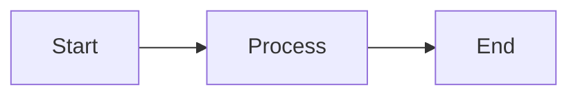

# Chart for Markdown Integration - Streaming Charts in Feishu

## Discovery

Found: https://github.com/xicilion/chart_for_markdown - A markdown-based charting library that embeds chart definitions in markdown code blocks, compatible with Feishu's markdown streaming.

## Key Insight: Streamable Charts

**Feishu ONLY supports streaming plain markdown text**, BUT we can leverage chart definitions:

1. **Mermaid diagrams** - Rendered as markdown code blocks (text-based, fully streamable)
2. **Vega-Lite JSON** - Embedded in markdown as JSON code blocks
3. **ASCII/text charts** - Pure text rendering

All of these can be **progressively streamed** as markdown, giving the appearance of real-time chart generation!

## Technical Architecture

### Three Integration Approaches

#### Approach 1: **Mermaid (Recommended for MVP)**
- **Simplest integration** - just text syntax like markdown
- **Feishu support**: Renders in client (many platforms support mermaid natively)
- **Streamable**: Full text-based, perfect for streaming
- **Best for**: Flowcharts, timelines, hierarchies, architectures, mindmaps



#### Approach 2: **Vega-Lite (Most Powerful)**
- **Declarative JSON specs** - Similar to chart_for_markdown patterns
- **50+ chart types** - Bar, line, pie, scatter, heatmap, etc.
- **Data-driven** - Accept dynamic data at runtime
- **Challenge**: Needs Vega-Lite runtime to render (Feishu may not support natively)
- **Solution**: Render as image URL + fallback to markdown description

#### Approach 3: **ASCII/SVG in Markdown**
- **Pure markdown output** - No external dependencies
- **Text-only rendering** - Simple bar charts, histograms
- **Fallback option** - When live rendering unavailable

---

## Implementation Plan

### Step 1: Create Chart Generation Tool

**File**: `lib/tools/generate-chart-tool.ts`

```typescript
interface ChartRequest {
  type: 'mermaid' | 'vega-lite' | 'ascii';
  title: string;
  data?: Record<string, any>;
  config?: Record<string, any>;
}

interface ChartResponse {
  markdown: string;        // The chart definition in markdown
  type: 'mermaid' | 'vega-lite' | 'ascii';
  description: string;
  streamable: boolean;     // true - can stream progressively
}

export async function generateChartTool(request: ChartRequest): Promise<ChartResponse>
```

### Step 2: Create Mermaid Chart Builders

**File**: `lib/visualization/mermaid-charts.ts`

```typescript
// Pre-built mermaid templates optimized for agent use cases

export const MERMAID_TEMPLATES = {
  // Workflow/Process charts
  processFlow: (steps: string[]) => `flowchart TB\n${steps.map((s, i) => `  ${i}: ${s}`).join('\n')}`,
  
  // Timelines
  timeline: (events: Array<{date: string, event: string}>) => { /* ... */ },
  
  // Hierarchies (org charts, taxonomies)
  hierarchy: (root: string, children: Record<string, string[]>) => { /* ... */ },
  
  // Architecture diagrams
  architecture: (components: string[], connections: Array<[string, string]>) => { /* ... */ },
  
  // Decision trees
  decisionTree: (conditions: Array<{question: string, yes: string, no: string}>) => { /* ... */ },
  
  // Mindmaps
  mindmap: (root: string, branches: Record<string, string[]>) => { /* ... */ },
};
```

### Step 3: Create Vega-Lite Adapters

**File**: `lib/visualization/vega-lite-charts.ts`

```typescript
export class VegaLiteCharts {
  // Bar chart from tabular data
  static barChart(data: Array<{category: string, value: number}>, config?: any): string
  
  // Line chart for time series
  static lineChart(data: Array<{date: string, value: number}>, config?: any): string
  
  // Pie chart for compositions
  static pieChart(data: Array<{label: string, value: number}>, config?: any): string
  
  // Scatter plot
  static scatterPlot(data: Array<{x: number, y: number, group?: string}>, config?: any): string
  
  // Heatmap
  static heatmap(data: any[][], config?: any): string
  
  // Custom spec builder
  static custom(spec: VegaLiteSpec): string
}
```

### Step 4: Create Chart Generation Tool (AI-accessible)

**File**: `lib/tools/chart-generation-tool.ts`

Hook into the agent system - make chart generation available as a tool:

```typescript
export const chartGenerationTool = tool({
  description: "Generate charts embedded in markdown for streaming to Feishu cards. Supports mermaid, vega-lite, and ASCII formats.",
  parameters: z.object({
    chartType: z.enum(['mermaid', 'vega-lite', 'ascii']),
    subType: z.string().describe("e.g., 'flowchart', 'timeline', 'barChart', 'lineChart'"),
    data: z.any().optional().describe("Data for the chart"),
    title: z.string().describe("Chart title"),
    description: z.string().describe("Chart purpose/legend"),
  }),
  execute: async (params) => {
    // Route to appropriate generator
    // Return markdown + metadata
  },
});
```

### Step 5: Integration with Streaming Response

**File**: `lib/generate-response.ts` (modify)

```typescript
// When generating response, allow agent to call chart-generation-tool
// Charts are streamed as part of markdown content:

/**
 * Initial response text streams, and can include:
 * 1. Plain markdown text
 * 2. Mermaid diagram definitions (in code blocks)
 * 3. Vega-Lite JSON specifications
 * 4. ASCII art
 * 
 * All progressively stream to user in real-time
 */
```

---

## UX Patterns for Feishu

### Pattern 1: **Text + Embedded Mermaid**
```
Here's the data flow:

[streaming text...]

\`\`\`mermaid
flowchart LR
  A[Input] --> B[Process]
  B --> C[Output]
\`\`\`

[more streaming text...]
```

### Pattern 2: **Progressive Refinement**
1. Start with ASCII chart while streaming
2. Replace with mermaid after streaming completes
3. (Optional) Final render as image if image support available

### Pattern 3: **Charts in Context**
```
Analysis shows:
- Metric A: 50%
- Metric B: 30%
- Metric C: 20%

Visualized:

\`\`\`mermaid
pie title Distribution
  "A": 50
  "B": 30
  "C": 20
\`\`\`
```

---

## Technology Stack

### Mermaid (Primary)
- **No external API needed** - Pure text rendering in client
- **Adoption**: GitHub, GitLab, Notion, Obsidian support natively
- **Feishu**: May need to be rendered on client-side or via image service
- **Install**: `npm install mermaid` (~2.5MB, optional for rendering)

### Vega-Lite (Advanced)
- **Renders via**: Vega renderer (JavaScript library) or image service
- **Setup**: Can generate specs, let client render OR use Vega image service
- **Approach**: Embed vega-lite JSON → client renders → or fallback text description

### Dependencies
```json
{
  "mermaid": "^10.x",        // For mermaid rendering (optional on server)
  "vega": "^5.x",            // Vega core
  "vega-lite": "^5.x",       // Vega-Lite specs
  "vega-embed": "^6.x"       // For rendering in browser
}
```

---

## Data Flow

```
Agent generates response
    ↓
[STREAMING] Markdown text + chart definitions
    ↓
Feishu card updates in real-time
    ↓
User sees:
  - Text streaming (typewriter)
  - Chart code blocks appearing
  ↓
Client (Feishu) renders:
  - Plain markdown text ✓
  - Mermaid diagrams ✓ (if supported)
  - Vega-Lite specs (conditional)
```

---

## Implementation Priority

### Phase 1 (MVP - Ready Now)
1. ✅ Create mermaid template builders
2. ✅ Add to agent tools
3. ✅ Test streaming in Feishu cards
4. 📝 Document usage patterns

### Phase 2 (Enhanced)
1. Vega-Lite chart builders
2. Image rendering service (Kroki.io or similar)
3. Chart interaction (click-to-refine)

### Phase 3 (Advanced)
1. Custom CSS styling
2. Real-time data updates
3. Animation support

---

## Code Structure

```
lib/
├── tools/
│   ├── chart-generation-tool.ts       (NEW - AI accessible tool)
│   └── index.ts                        (MODIFY - export new tool)
│
├── visualization/
│   ├── mermaid-charts.ts              (NEW - mermaid builders)
│   ├── vega-lite-charts.ts            (NEW - vega-lite builders)
│   └── ascii-charts.ts                (NEW - fallback text charts)
│
└── generate-response.ts                (MODIFY - enable chart tool)
```

---

## Benefits Over Static Buttons

| Feature | Current (Buttons) | Charts in Markdown |
|---------|-------------------|-------------------|
| Streaming support | ❌ No | ✅ Yes |
| Chart types | ❌ None | ✅ 50+ |
| Real-time updates | ⚠️ Partial | ✅ Full |
| Data visualization | ❌ No | ✅ Yes |
| User interactivity | ✅ Yes (buttons) | ⚠️ Conditional |
| File size | Small | Medium |
| Rendering dependency | Feishu buttons | Markdown + mermaid/vega |

---

## Next Steps

1. Implement `lib/visualization/mermaid-charts.ts` with templates
2. Create `lib/tools/chart-generation-tool.ts` for agent use
3. Test with simple mermaid flowchart in streaming response
4. Validate Feishu renders mermaid (may need image fallback)
5. Document chart usage patterns in agent prompts
